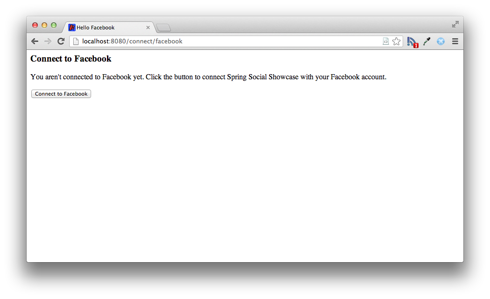
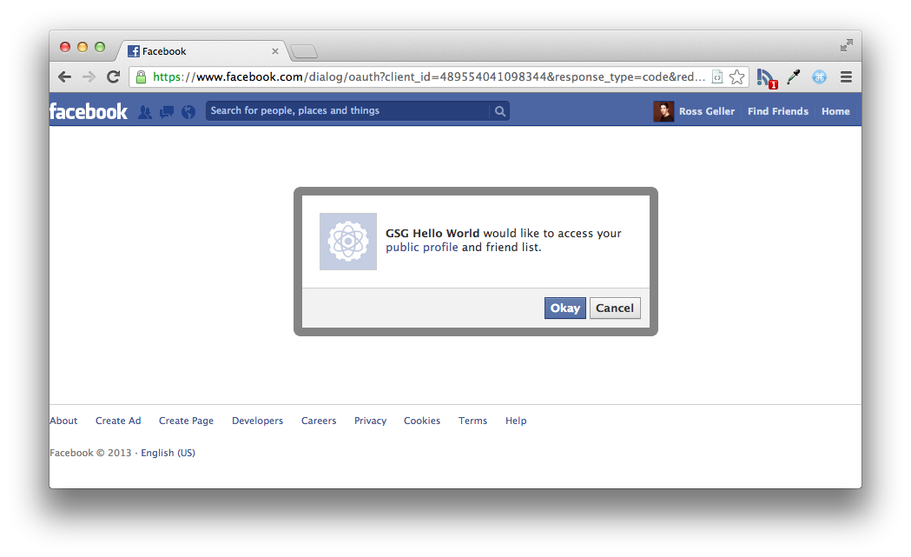
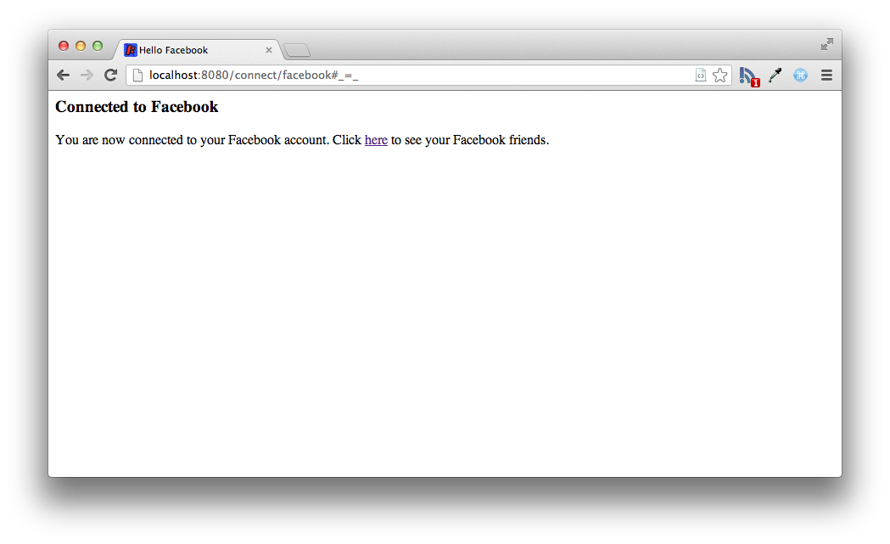

:spring_version: current
:spring_boot_version: 1.3.6.RELEASE
:EnableJdbcConnectionRepository: http://docs.spring.io/spring-social/docs/1.1.x/api/org/springframework/social/config/annotation/EnableJdbcConnectionRepository.html
:SecurityContext: http://docs.spring.io/spring-security/site/docs/3.2.x/apidocs/org/springframework/security/core/context/SecurityContext.html
:DispatcherServlet: http://docs.spring.io/spring/docs/{spring_version}/javadoc-api/org/springframework/web/servlet/DispatcherServlet.html
:SpringApplication: http://docs.spring.io/spring-boot/docs/{spring_boot_version}/api/org/springframework/boot/SpringApplication.html
:ConnectionRepository: http://docs.spring.io/spring-social/docs/1.1.x/api/org/springframework/social/connect/ConnectionRepository.html
:Authentication: http://docs.spring.io/spring-security/site/docs/3.2.x/apidocs/org/springframework/security/core/Authentication.html
:ConnectController: http://docs.spring.io/spring-social/docs/1.1.x/api/org/springframework/social/connect/web/ConnectController.html
:ConnectionFactoryLocator: http://docs.spring.io/spring-social/docs/1.1.x/api/org/springframework/social/connect/ConnectionFactoryLocator.html
:EnableFacebook: http://docs.spring.io/spring-social-facebook/docs/1.1.x/api/org/springframework/social/facebook/config/annotation/EnableFacebook.html
:gs-register-facebook-app: link:/guides/gs/register-facebook-app
:toc:
:icons: font
:source-highlighter: prettify
:project_id: gs-accessing-facebook

This guide walks you through the process of creating a simple web application that accesses Facebook data. 

== What you'll build

You'll build a web application that accesses data from a Facebook user profile, as well as posts from that user's Facebook feed.

== What you'll need

:java_version: 1.8
include::https://raw.githubusercontent.com/spring-guides/getting-started-macros/master/prereq_editor_jdk_buildtools.adoc[]
+
- An application ID and secret obtained from {gs-register-facebook-app}[registering an application with Facebook].

include::https://raw.githubusercontent.com/spring-guides/getting-started-macros/master/how_to_complete_this_guide.adoc[]

include::https://raw.githubusercontent.com/spring-guides/getting-started-macros/master/hide-show-gradle.adoc[]

include::https://raw.githubusercontent.com/spring-guides/getting-started-macros/master/hide-show-maven.adoc[]

include::https://raw.githubusercontent.com/spring-guides/getting-started-macros/master/hide-show-sts.adoc[]

[[initial]]
== Enable Facebook

Before you can fetch a user's data from Facebook, you must specify your application's ID and secret by setting the `spring.social.facebook.appId` and `spring.social.facebook.appSecret` properties. You can set these via any means supported by Spring Boot, including setting them in an `application.properties` file:

`src/main/resources/application.properties`
[source,properties]
----
include::complete/src/main/resources/application.properties[]
----

As shown here, the properties have fake values. The values given to these properties correspond to your application's consumer key and secret you obtain when you {gs-register-facebook-app}[register the application with Facebook]. For the code to work, substitute the real values given to you by Facebook in place of the fake values.

The presence of these properties and Spring Social Facebook in the classpath will trigger automatic configuration of Spring Social's `ConnectController`, `FacebookConnectionFactory`, and other components of Spring Social's connection framework.

== Create connection status views

Although much of what `ConnectController` does involves redirecting to Facebook and handling a redirect from Facebook, it also shows connection status when a GET request to /connect is made. It defers to a view named connect/{providerId}Connect when no existing connection is available and to connect/{providerId}Connected when a connection exists for the provider. In this case, *provider ID* is "facebook".

`ConnectController` does not define its own connection views, so you need to create them. First, here's a Thymeleaf view to be shown when no connection to Facebook exists:

`src/main/resources/templates/connect/facebookConnect.html`
[source,html]
----
include::complete/src/main/resources/templates/connect/facebookConnect.html[]
----

The form on this view will POST to /connect/facebook, which is handled by `ConnectController` and will kick off the OAuth authorization code flow.

Here's the view to be displayed when a connection exists:

`src/main/resources/templates/connect/facebookConnected.html`
[source,html]
----
include::complete/src/main/resources/templates/connect/facebookConnected.html[]
----

== Fetch Facebook data

With Facebook configured in your application, you now can write a Spring MVC controller that fetches data for the user who authorized the application and presents it in the browser. `HelloController` is just such a controller:

`src/main/java/hello/HelloController.java`
[source,java]
----
include::complete/src/main/java/hello/HelloController.java[]
----

`HelloController` is created by injecting a `Facebook` object into its constructor. The `Facebook` object is a reference to Spring Social's Facebook API binding.

The `helloFacebook()` method is annotated with `@RequestMapping` to indicate that it should handle GET requests for the root path (/). The first thing the method does is check whether the user has authorized the application to access the user's Facebook data. If not, the user is redirected to `ConnectController` with the option to kick off the authorization process.

If the user has authorized the application to access Facebook data, the application fetches the user's profile as well as several of the most recent entries in the user's feed. The data is placed into the model to be displayed by the view identified as "hello".

Speaking of the "hello" view, here it is as a Thymeleaf template:

`src/main/resources/templates/hello.html`
[source,html]
----
include::complete/src/main/resources/templates/hello.html[]
----

== Make the application executable

Although it is possible to package this service as a traditional _web application archive_ or link:/understanding/WAR[WAR] file for deployment to an external application server, the simpler approach demonstrated below creates a _standalone application_. You package everything in a single, executable JAR file, driven by a good old Java `main()` method. And along the way, you use Spring's support for embedding the link:/understanding/Tomcat[Tomcat] servlet container as the HTTP runtime, instead of deploying to an external instance.

`src/main/java/hello/Application.java`
[source,java]
----
include::complete/src/main/java/hello/Application.java[]
----

`@SpringBootApplication` is a convenience annotation that adds all of the following:
    
- `@Configuration` tags the class as a source of bean definitions for the application context.
- `@EnableAutoConfiguration` tells Spring Boot to start adding beans based on classpath settings, other beans, and various property settings.
- Normally you would add `@EnableWebMvc` for a Spring MVC app, but Spring Boot adds it automatically when it sees **spring-webmvc** on the classpath. This flags the application as a web application and activates key behaviors such as setting up a `DispatcherServlet`.
- `@ComponentScan` tells Spring to look for other components, configurations, and services in the the `hello` package, allowing it to find the `HelloController`.

The `main()` method uses Spring Boot's `SpringApplication.run()` method to launch an application. Did you notice that there wasn't a single line of XML? No **web.xml** file either. This web application is 100% pure Java and you didn't have to deal with configuring any plumbing or infrastructure.

include::https://raw.githubusercontent.com/spring-guides/getting-started-macros/master/build_an_executable_jar_subhead.adoc[]
include::https://raw.githubusercontent.com/spring-guides/getting-started-macros/master/build_an_executable_jar_with_both.adoc[]

....
... app starts up ...
....

Once the application starts up, point your web browser to http://localhost:8080. No connection is established yet, so this screen prompts you to connect with Facebook:

When you click the **Connect to Facebook** button, the browser is redirected to Facebook for authorization:

Click "Okay" to grant permission for the sample application to access your public profile and your feed.

Once permission is granted, Facebook redirects the browser back to the application. A connection is created and stored in the connection repository. You should see this page indicating that a connection was successful:

Click the link on the connection status page, and you are taken to the home page. This time, now that a connection has been created, you see your name on Facebook and a list of some recent entries in your home feed. Included for each post in the feed list is the name of the sender, the post's message, and the post's picture (if available).

== Summary
Congratulations! You have developed a simple web application that obtains user authorization to fetch data from Facebook. The application connects the user to Facebook through Spring Social, retrieves data from the user's Facebook profile, and also fetches profile data from the user's Facebook friends. 

include::https://raw.githubusercontent.com/spring-guides/getting-started-macros/master/footer.adoc[]

